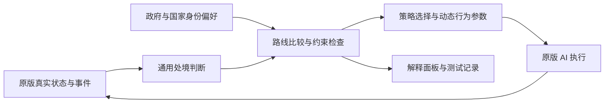

# 03 · 处境决策设计

> **状态**：当前设计基线，2026-10-04。通用财政机制已实现，两国生命周期已有 Windows 实机证据；行为反事实与稳定性验收推进中。
> **适用范围**：mod 行为、产品形式和机制验收。工程契约继续使用 [工程基线 1.0](exec/工程基线-1.0.md)。
> **实施入口**：[最终执行纲领 1.0](exec/mod重设计-实施计划.md) 已于 2026-10-06 定型，统一管理阶段出口、变化分支与发布；实验和进度更新到结果页，未完成项见 [backlog](backlog.md) 的“mod 重设计”节。

## 1. 目标与产品形式

让 Victoria 3 的 AI 国家依据内部因素、外部因素和自身政治偏好，在可行路线中作出更合理的选择，
并随玩家改变世界重新评估。在官方 AI 基础上增强，保留其具体执行系统。

“更合理”指在模组可观察的信息、可表达的候选路线和明确约束内改善选择；不承诺全局最优、
完整长期预测或永远正确。有限理性包含信息不足、政治摩擦、风险和保持现状的倾向。
国家的偏好由政府、统治联盟、制度和历史身份共同影响，不预设所有国家都应改革或扩张。

正式产品采用后台自治和可选解释面板。玩家正常游玩，无须用大量按钮指挥 AI 国家，也无须安装
Python 或启动外部决策服务。模组不添加免费收入、部队或其他用于伪装决策改善的数值优势。

仓库自有文本保持 UTF-8 无 BOM、LF；游戏要求的编码转换继续放在安装与打包边界。
Python 工具支持 Windows、macOS、Linux；游戏行为与 GUI 自动化的实机证据按平台分别申报。

## 2. 核心架构

这个流程是行为设计模型，不表示引擎已经提供通用规划器、完整路线评分或可随意调用的重评估接口。
每一段只通过已核对的脚本接口落地；不能表达的能力明确留空或收窄目标，不用模拟成功代替实机证据。

### 2.1 世界模拟与决策增强分别管理

默认决策层读取原版已经发生的变化。战败是重新评估的输入，不自动等于削弱地主、增强改革派或强制改革。
为了让 AI 选某条路线而直接改变合法性、IG 力量或法律成功率，不作为默认生产方案。

若确有必要补充战争创伤等世界机制，该模块必须有独立因果、生命周期、开关和行为验收，
对玩家与 AI 使用同样规则。它与决策层分别测试、分别统计效果；压力注入仍可用于隔离实验。

### 2.2 通用机制优先，国家身份修正偏好

机制按财政存续、外部安全、市场依赖、政治稳定与改革机会、过度扩张等处境组织。
国家共享规则，通过政府、政治力量、资源结构、位置和身份得到不同判断。
国家标签仅用于确实独有的历史内容，不为每个国家复制一套相同的危机脚本。

初期只实现一条有边界的闭环。完整目标不等于首版同时覆盖所有因素、所有国家和三个策略槽。

### 2.3 事实、偏好、约束、证据分别记录

| 信息 | 内容 | 使用边界 |
|---|---|---|
| 事实 | 财政、战争、政治力量、法律、市场与外部关系 | 标注来源、作用域、版本、更新方式和未知值 |
| 偏好 | 存续、统治稳定、发展、安全、威望及身份目标的相对优先级 | 明示设计假设；通过敏感性分析和对照实验校准 |
| 约束 | 资源不足、政治阻力、风险与执行条件 | 区分不可行条件与软性代价，不能随意绕过原版限制 |
| 证据 | 官方说明、脚本事实、实机读数、推断和待验证项 | 表示结论可信度，不作为国家偏好权重 |

第一版采用少量可审计的条件、优先级和评分，不建立庞大的连续效用求解器。
先排除在当前模型中不可行的路线，再比较目标收益、代价、摩擦与惯性；每个分支都应有可证伪的判据。
未知输入不得静默当作安全或零风险；根据规则显式保留当前路线、使用保守判断或停止该项干预。

工具能够读取某个国家的内部数据，不等于另一个国家应该知道这些数据。对外判断定义允许的信息范围，
不读取玩家秘密计划或利用引擎可见范围伪装全知；不做复杂且无验证依据的概率预测。

### 2.4 少量长期路线与动态行为字段

策略牌是引擎表达政策方向的接口。`possible` 和 `weight` 管选择资格与抽取，牌面行为字段管持牌后的倾向；
只提高抽取权重不能证明后续行为改善。自建策略进入正式实现前，必须明确完整行为字段和占槽代价。

优先以少量长期路线承载随真实状态变化的参数；方向明显变化时才切换路线。
对每个字段分别核对相加、覆盖或其他语义，以及可用的国家、目标国和目标州作用域。
路线选择只能使用确有接口的机制；`set_strategy` 等效果逐项验证，不假设存在请求重评估、保存并恢复
任意策略、清除策略并归还原版控制等尚未确认的 API。

同一国家、同一槽的主动写入由统一逻辑管理；自然抽取与主动切换的职责必须明确，不能让多个 JE 和事件
分别强制写不同路线。危机结束后依据当前状态重新判断，不硬回开局牌。
优先使用追加和命名空间隔离，保留原版子系统。若某项能力需要改变原版键，先明确缺口、最小范围、
兼容与归因成本，再作专项设计；不把新增条目误写成无行为替代成本，也不默认加速全局策略重抽。

### 2.5 稳定性与性能

路线和处境使用不同的进入、退出条件，配合冷却、最短保持时间和改善幅度门槛。
生存危机等紧急例外独立列出并测试。生命周期必须显式：输入过期不能只在施加时检查一次，
却让长期修正继续存在；期限到达、状态退出与重复触发均需有清理规则。

更新以事件通知和低频错峰兜底结合，处理没有事件入口的变化。轻量条件可以直接读取；
昂贵计算才缓存，并明示失效条件。每次求值的 script value 不视为缓存。
热路径不遍历全世界；外交评分尽量使用引擎提供的目标作用域，额外扫描限于明确的对手、邻国或伙伴。
兜底频率、分片和缓存只能使用确认存在的脚本机制，按实机 CPU、帧尖峰和内存读数确定预算。

### 2.6 解释面板是决策结果的呈现

JE、tooltip 或后续界面展示当前倾向、主要原因和重新评估条件。解释从实际使用的规则生成，
不把固定文案当作引擎思考过程，也不把模组偏好写成行动已经发生。
开发记录区分输入、建议路线、实际持牌、实际行动及结果；原版执行可能因其他约束而不采取行动。

## 3. 引擎能力与当前实现边界

当前实验实现读取真实财政风险，已有外交承诺（战争、博弈发起方/目标方/承诺参与方）时追加默认策略的 neutrality 条件偏置。2026-10-09 已将 aggression 设为 0，生成器不再写入该生产偏置；政治与市场扩展开关仍关闭。评分通道可读不等于行为质量已通过。
所有国家共享规则，保留三槽路线；财政变量有迟滞与62天TTL，实际字段同时检查当前财政条件。
默认策略采用版本锁定的同路径覆盖，有明确兼容成本。两国进入、激活、退出的Windows实机证据见[M2结果](exec/M2-结果.md)，行为收益仍待M3对照。

以下是旧实验档案的静态核对。它们隔离在 `mod/legacy/`，不进入生产包，仍按其游戏版本与条件复现。

| 已核对内容 | 依据 | 对新设计的影响 |
|---|---|---|
| 九份档案中正式冲击钩子当前主要接通俄罗斯；两条路径只调用 shock | [俄罗斯 on_action](../../mod/legacy/common/on_actions/sitai_ru_defeat_on_actions.txt) | 档案数不作为通用动态行为覆盖数 |
| 改革输入独立定义，没有接到真实战败 shock；投降叠加施加时检查变量，期限为十年 | [俄罗斯效果](../../mod/legacy/common/scripted_effects/sitai_ru_defeat_effects.txt) | 接线、时限及注释不一致先列入迁移欠账 |
| 俄罗斯旧政治牌保留；曾新增的压力外交牌已撤回 | [俄罗斯政治牌](../../mod/legacy/common/ai_strategies/sitai_ru_defeat_agenda.txt) | 旧政治牌不进入生产闭环；`possible` 不能证明持有后退出 |
| JE 在合法性同一边界开关，开窗递进步牌、完成递反动牌 | [俄罗斯 JE](../../mod/legacy/common/journal_entries/sitai_ru_defeat_window.txt) | 新设计补迟滞和当前状态重评估 |
| 现有重抽节奏 defines 对所有国家生效 | [节奏配置](../../mod/legacy/common/defines/sitai_ru_defeat_tempo.txt) | 新实验统一对照配置，正式方案不默认沿用 |
| objectives 的 tier 表示落地与证据等级 | [目标表实现](../../src/pdx/objectives.py) | 保留审计用途，运行时偏好另行设计 |
| 原版读具名变量与 JE，不会自动读取任意新增状态 | [backlog 的 B52](backlog.md) | 新状态必须有实际读取者和效果验证 |
| 存在策略字段与运行时 set_strategy；部分字段具有目标作用域 | [AI 策略字段参考](../victoria3-modding/10-AI策略字段参考.md) | 逐接口测效果，不承诺接管 C++ 内部执行 |

所有“已接通”“有效”结论以可执行块和实机记录为准。注释与代码冲突时先记录问题，
不因旧说明使用了“正式”“完成”等词就越过证据边界。

## 4. 工程复用与迁移

继续使用现有分析、快照、Python 生成器、CI、测试、安装打包、性能工具和实机自动化。
新机制只增量适配数据模型、生成模板、机制测试和行为判据；不开展新的全仓目录重整。
成熟库用于通用解析、校验、测试和测量；引擎专用规则保留必要的自有实现。

生产源为 `mod/decisions/*.toml`，根级游戏文件由 `pdx.decisions` 生成；`mod/data/*.toml` 只生成至 `mod/legacy/`。
它们提供实验资产与已有证据，不自动成为新机制的正式规则。迁移逐模块进行，明确旧逻辑何时停止生效、
存档中旧变量与修正如何处理、哪些实验需要重跑。安装文件恢复与存档内状态恢复分别验证。
生成文档描述当前产物；手写设计文档描述计划，两者不能混用。

## 5. 验收与反事实

| 层级 | 要证明 | 不能据此宣称 |
|---|---|---|
| 工程正确性 | 数据校验、生成一致性、引用、编码与跨平台工具正常 | 游戏运行期接口已经有效 |
| 接口有效性 | 状态读法和策略字段在游戏内被使用 | 完整路线已经更优 |
| 行为因果 | 改变一个输入后，行为分布按明确假设变化 | 一次换牌或一次开窗足够证明成功 |
| 质量与稳定性 | 无谓风险减少，机会利用改善，身份差异与可解释性保留 | 更凶、更难或日志更多就是更聪明 |
| 性能与维护 | 后期与压力场景开销可接受，生命周期和版本迁移可靠 | Python 基准可以替代游戏内测量 |

离线测试覆盖边界、未知输入、重复触发、冲突、迟滞、冷却及规则性质；若另建 Python 参考判断，
须验证它与生成脚本一致，不能仅测参考实现。工程用例按相关范围运行，不为文案变化新增镜像测试。

实机使用相同游戏版本和实验配置，对原版、仅决策层、仅世界机制、组合分别比较；没有新增世界机制时
不必制造空的实验组。跨开局或随机种子重复，能够固定时配对，记录实际种子控制能力及残余随机性。
预先定义观测窗口、有效机会、行为指标和失败条件，报告效应、波动与不利结果，避免只挑成功局。

反事实示例属于设计假设：俄罗斯战败但改革联盟弱时可能先整顿；联盟具备条件时才尝试改革；
没有战败也可能因内部变化转向。巴伐利亚应比较安全、市场与主权代价；改变外部保障后选边倾向应能变化。
它们不是当前已完成的行为承诺，也不作为首个闭环必须实现的全部内容。

## 6. 文档效力与设计变更

| 文档 | 当前用途 |
|---|---|
| 本文件 | 当前行为设计、产品形式、机制边界与验收 |
| `exec/工程基线-1.0.md` | 当前工程契约与证据边界 |
| `exec/mod重设计-实施计划.md` | 新机制的实施顺序与结果登记方式 |
| `backlog.md` | 研究欠账；新优先项在“mod 重设计”节 |
| `01-大方向.md`、`01a-依据与参考.md` | 历史方向、实验事实与原引用锚点 |
| `02-可执行面.md`、知识库生成表、`mod/legacy/sitai_*.md` | 当前工具按数据源生成的事实，不手改 |
| 旧阶段与交接记录、CHANGELOG 0.1.0 | 当时的任务、读数和版本说明 |

本设计替代旧“改世界优先”和固定三槽概率配平的手段要求，保留增强原版、无作弊、可解释、
正确性优先与可复现目标。新实现只保证在已验证候选和约束内改善选择，不声称已实现通用最优解。
设计修改应记录理由、影响与验证方式；历史实验不得被新方案追认成未运行过的证据。
